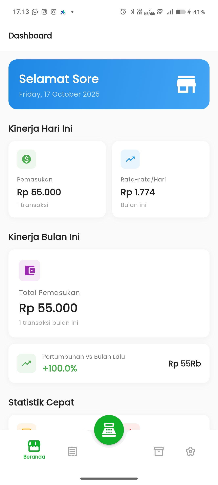
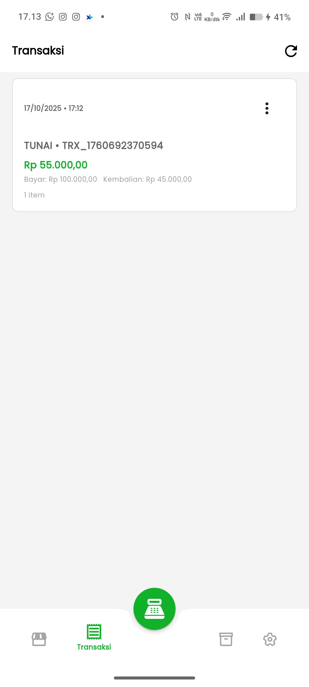
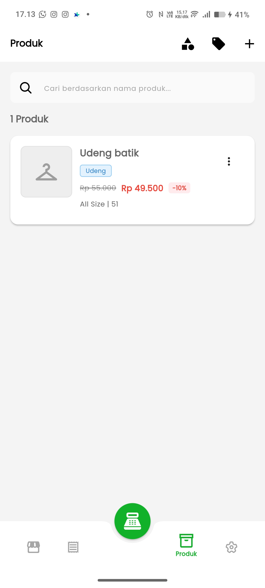
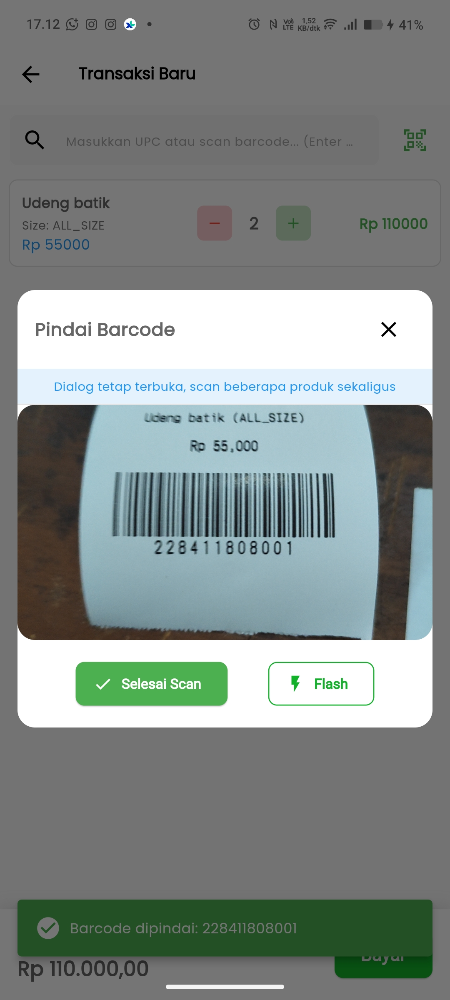
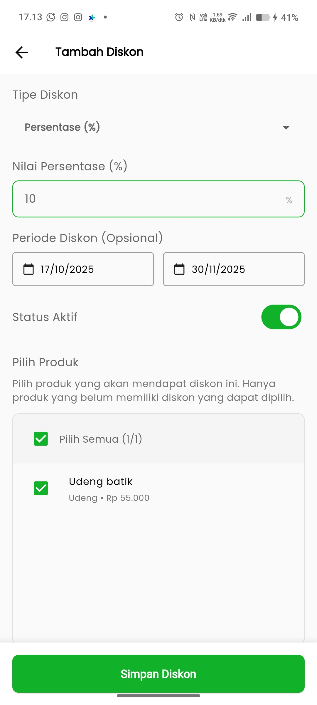
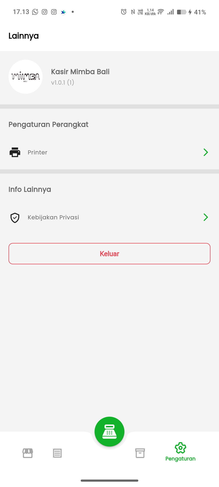

# 🏪 Kasir Mimba Bali - Point of Sale (POS) Application

<div align="center">
  


**Modern POS Application for Small & Medium Businesses**

[Features](#-features) • [Installation](#-installation) • [Usage](#-usage) • [Screenshots](#-screenshots) • [Contributing](#-contributing)

</div>

---

## 📖 About

**Kasir Mimba Bali** is a comprehensive Point of Sales (POS) application built with Flutter, specifically designed for small to medium businesses like clothing stores, cafes, and retail shops. The app provides complete sales management with offline-first approach, ensuring your business operations continue smoothly even without internet connection.

### 🎯 **Target Users**

- Small retail stores
- Clothing boutiques
- Cafes and restaurants
- Any business requiring sales tracking

---

## ✨ Features

### 🛒 **Sales Management**

- **Transaction Processing**: Quick and easy checkout process
- **Multiple Payment Methods**: Cash, Card, E-Wallet, QRIS, Bank Transfer, Voucher
- **Real-time Cart Management**: Add, remove, modify quantities
- **Barcode Scanner**: Camera and hardware scanner support
- **Receipt Printing**: Bluetooth thermal printer integration

### 📦 **Inventory Management**

- **Product Management**: Add, edit, delete products with variants
- **Category Organization**: Organize products by categories
- **Stock Tracking**: Real-time stock updates and low stock alerts
- **Size Variants**: Support for multiple sizes (XXS-XXXL, ALL_SIZE)
- **UPC/SKU Management**: Unique product identification

### 💰 **Discount System**

- **Percentage Discounts**: Apply percentage-based discounts
- **Fixed Amount Discounts**: Set fixed discount amounts
- **Time-based Discounts**: Schedule discount periods
- **Product-specific Discounts**: Apply discounts to specific products

### 📊 **Analytics & Reporting**

- **Sales Dashboard**: Real-time sales statistics
- **Performance Metrics**: Daily, monthly, quarterly insights
- **Growth Analysis**: Month-over-month comparison
- **Low Stock Alerts**: Interactive inventory warnings
- **Payment Method Analytics**: Popular payment tracking

### 🖨️ **Printing & Hardware**

- **Bluetooth Printer Support**: Connect to thermal printers
- **Receipt Formatting**: Professional receipt layout
- **Product Name Wrapping**: Automatic text formatting
- **Print Status Management**: Connection and error handling

### 🎨 **User Experience**

- **Modern UI/UX**: Clean, intuitive interface
- **Dark/Light Theme**: Adaptive color schemes
- **Responsive Design**: Works on different screen sizes
- **Offline-First**: No internet required for core functions
- **Multi-language Support**: Indonesian localization

---

## 🛠️ Technical Stack

### **Frontend**

- **Flutter 3.9.2+**: Cross-platform UI framework
- **Dart**: Programming language
- **Material Design 3**: Modern UI components

### **Backend & Storage**

- **SQLite**: Local database storage
- **SharedPreferences**: App settings and preferences

### **Key Dependencies**

```yaml
dependencies:
  flutter:
    sdk: flutter
  google_fonts: ^6.2.1 # Google Fonts for custom typography
  flutter_bloc: ^9.1.1 # State management with BLoC pattern
  equatable: ^2.0.5 # Value equality for Dart objects
  shared_preferences: ^2.2.3 # Persistent key-value storage
  json_annotation: ^4.9.0 # JSON serialization
  bloc: ^9.0.1 # BLoC state management
  cupertino_icons: ^1.0.8 # iOS style icons
  sqflite: ^2.4.2 # SQLite database
  path: ^1.9.1 # File path utilities
  esc_pos_utils: ^1.1.0 # ESC/POS printer utilities
  print_bluetooth_thermal: ^1.1.6 # Bluetooth thermal printing
  permission_handler: ^12.0.1 # Runtime permissions
  image: ^3.3.0 # Image processing
  intl: ^0.20.2 # Internationalization and localization
  mobile_scanner: ^7.1.2 # Barcode scanning
  flutter_launcher_icons: ^0.11.0 # App icon generation
  package_info_plus: ^9.0.0 # App package information
  file_picker: ^8.1.2 # File picking
  path_provider: ^2.1.4 # File system paths
```

### **Database Schema**

- **Kategori**: Product categories
- **Produk**: Product information
- **Produk_Varian**: Product variants with size/stock
- **Diskon**: Discount management
- **Transaksi**: Sales transactions
- **Detail_Transaksi**: Transaction details

---

## 🚀 Installation

### **Prerequisites**

- Flutter SDK 3.9.2 or higher
- Dart SDK 3.0+
- Android Studio / VS Code
- Android device/emulator (API level 21+)

### **Setup Steps**

1. **Clone Repository**

   ```bash
   git clone https://github.com/Andndre/kasir_mimba_bali.git
   cd kasir_mimba_bali
   ```

2. **Install Dependencies**

   ```bash
   flutter pub get
   ```

3. **Run Application**
   ```bash
   flutter run
   ```

### **Build for Release**

```bash
# Android APK
flutter build apk --release

# Android App Bundle
flutter build appbundle --release
```

---

## 📱 Usage

### **Getting Started**

1. **Launch the app** - Open Kasir App
2. **Setup products** - Add your inventory via Product Management
3. **Configure printer** - Connect Bluetooth thermal printer (optional)
4. **Start selling** - Use the main transaction screen

### **Core Workflows**

#### **Processing a Sale**

1. Scan barcode or search products
2. Add items to cart with quantities
3. Apply discounts if needed
4. Choose payment method
5. Complete transaction and print receipt

#### **Managing Inventory**

1. Go to Product Management
2. Add categories and products
3. Set prices, stock levels, and variants
4. Configure discounts as needed

#### **Viewing Reports**

1. Check dashboard for daily statistics
2. View monthly performance metrics
3. Monitor low stock alerts
4. Analyze payment method trends

---

## 📸 Screenshots

<div align="center">
  <table>
    <tr>
      <td align="center">
        
        <br><strong>Dashboard</strong>
      </td>
      <td align="center">
        
        <br><strong>Transaction</strong>
      </td>
      <td align="center">
        
        <br><strong>Products</strong>
      </td>
    </tr>
    <tr>
      <td align="center">
        
        <br><strong>Barcode Scanner</strong>
      </td>
      <td align="center">
        
        <br><strong>Discounts</strong>
      </td>
      <td align="center">
        
        <br><strong>Settings</strong>
      </td>
    </tr>
  </table>
</div>

---

## 🗂️ Project Structure

```
lib/
├── app/                    # App configuration
├── core/                   # Core utilities
│   ├── components/         # Reusable widgets
│   ├── data/              # Database configuration
│   ├── extensions/        # Dart extensions
│   └── helpers/           # Helper functions
├── features/              # Feature modules
│   ├── discount/          # Discount management
│   ├── home/             # Dashboard
│   ├── kasir/            # Transaction processing
│   ├── product/          # Product management
│   └── settings/         # App settings
├── model/                # Data models
└── main.dart            # App entry point
```

---

## 🔧 Configuration

### **Printer Setup**

1. Enable Bluetooth on device
2. Pair with thermal printer
3. Go to Settings → Printer
4. Connect and test print

### **Permissions Required**

- **Camera**: For barcode scanning
- **Bluetooth**: For printer connectivity
- **Storage**: For data backup (optional)

---

## 🤝 Contributing

We welcome contributions! Please follow these steps:

1. **Fork the repository**
2. **Create feature branch** (`git checkout -b feature/amazing-feature`)
3. **Commit changes** (`git commit -m 'Add amazing feature'`)
4. **Push to branch** (`git push origin feature/amazing-feature`)
5. **Open Pull Request**

### **Development Guidelines**

- Follow Flutter/Dart style guide
- Write meaningful commit messages
- Add comments for complex logic
- Test on different screen sizes

---

## 📄 License

This project is licensed under the MIT License - see the [LICENSE](LICENSE) file for details.

---

## 👥 Team

- **Developer**: [Andndre](https://github.com/Andndre)
- **Project**: Kasir Mimba Bali

---

## 📞 Support

- **Email**: agungandre687@gmail.com
- **Issues**: [GitHub Issues](https://github.com/Andndre/kasir_mimba_bali/issues)
- **Documentation**: [Wiki](https://github.com/Andndre/kasir_mimba_bali/wiki)

---

## 🙏 Acknowledgments

- Flutter team for the amazing framework
- SQLite for reliable local storage
- Open source community for various packages
- Beta testers and early adopters

---

<div align="center">
  <strong>Made with ❤️ for small businesses everywhere</strong>

⭐ **Star this repo if you find it helpful!** ⭐

</div>
