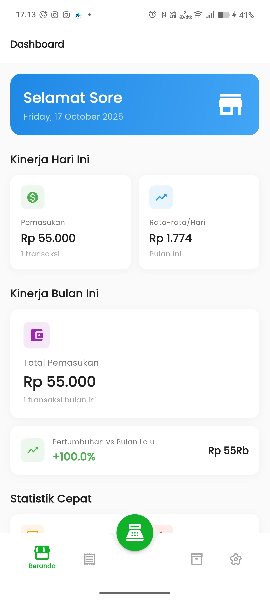
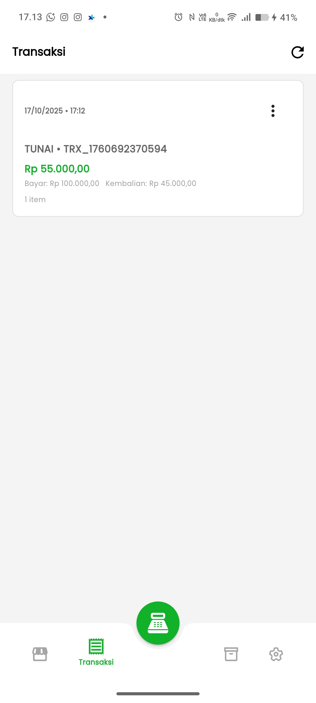
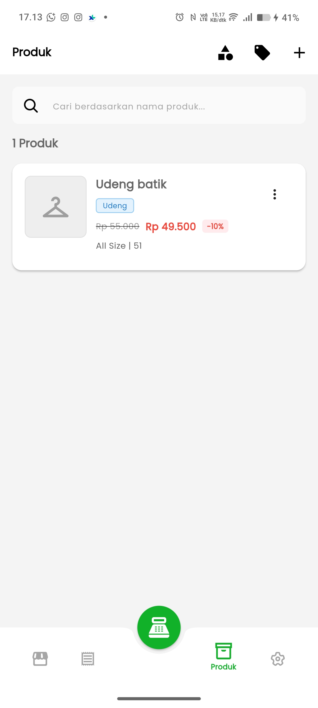
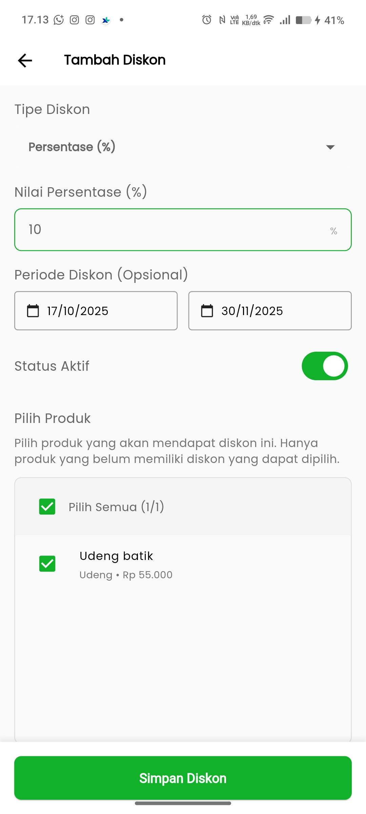
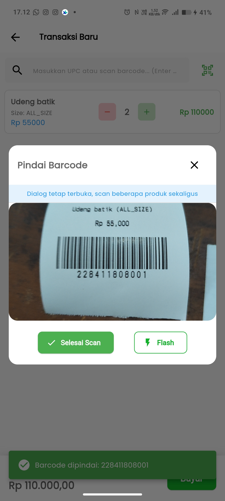
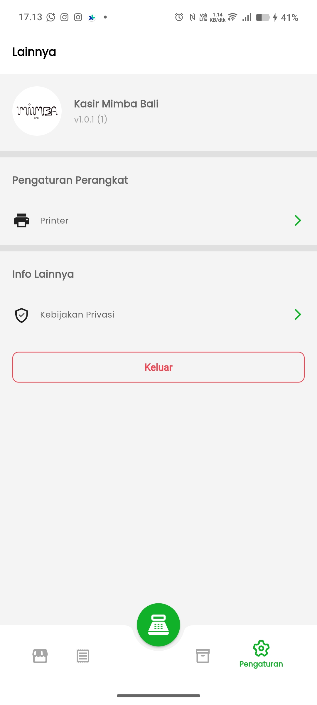

# 📸 Luminara Photobooth - Management System (Local Network)

<div align="center">
  


**Modern Photobooth Management for Local Networks**

[About](#-about) • [Features](#-features) • [Screenshots](#-screenshots) • [Technical Stack](#-technical-stack) • [Installation](#-installation) • [Configuration](#-configuration)

</div>

---

## 📖 About

**Luminara Photobooth** is a comprehensive management system built with Flutter, designed for photobooth businesses. It operates on a local network (LAN) using a dual-mode architecture (Server/Cashier & Client/Verifier), allowing for real-time synchronization and offline operation.

The system now supports **Digital Payments (QRIS)** via Midtrans, seamlessly integrated into both Desktop and Mobile interfaces.

### 🎯 **Target Users**

- Photobooth owners
- Event organizers
- Photography studios

---

## ✨ Features

### 🛒 **Server Mode (Cashier)**

- **Transaction Management**: Select packages and create transactions.
- **Digital Payments (QRIS)**:
  - **Native Integration**: Integrated WebView for payment flow (no external browser needed).
  - **Multi-Platform**: Works on Android (Dialog) and Desktop Linux/Windows (Pop-up Window).
  - **Auto-Sync**: Automatically detects payment success and prints tickets.
- **Embedded Server**: Automatically hosts an Alfred HTTP & WebSocket server.
- **Ticket Printing**: Print thermal receipts with unique QR codes for verification.
- **Pairing QR**: Display IP and Port for mobile client connection.
- **Real-time Broadcast**: Notifies all connected clients of new tickets.

### 📦 **Client Mode (Verifier)**

- **LAN Pairing**: Scan server's QR code to connect instantly.
- **Live Queue**: Real-time list of paid tickets awaiting service.
- **QR Scanner**: Scan customer tickets to verify entry.
- **Instant Validation**: Check ticket status via Server API and update to COMPLETED.

### 📊 **Analytics & Infrastructure**

- **Dashboard**: Real-time sales statistics and queue count.
- **Audit Trail**: Tracks Midtrans Order IDs for payment reconciliation.
- **Isolate-Based Server**: Ensures UI responsiveness on Linux/Windows desktops.
- **Offline-First**: Operates entirely without internet connection (except for QRIS payment initiation).

---

## 📸 Screenshots

<table width="100%">
  <tr>
    <td width="50%" align="center">
      <b>Dashboard</b><br/>
      
    </td>
    <td width="50%" align="center">
      <b>Transactions</b><br/>
      
    </td>
  </tr>
  <tr>
    <td width="50%" align="center">
      <b>Products</b><br/>
      
    </td>
    <td width="50%" align="center">
      <b>Discounts</b><br/>
      
    </td>
  </tr>
  <tr>
    <td width="50%" align="center">
      <b>Scanner (Client Mode)</b><br/>
      
    </td>
    <td width="50%" align="center">
      <b>Settings</b><br/>
      
    </td>
  </tr>
</table>

---

## 🛠️ Technical Stack

### **Core**

- **Flutter**: Cross-platform UI framework (Android, Linux, Windows).
- **Dart**: Programming language.
- **Alfred**: Embedded HTTP/WebSocket server for LAN sync.
- **SQLite (FFI)**: Local database for Server mode.

### **Integrations**

- **Midtrans**: Payment Gateway (QRIS, VA, E-Wallet).
- **Luminara Transaksi**: Backend Service (Laravel) for payment processing.

---

## 🚀 Installation

### **Prerequisites**

- Flutter SDK (3.9.2+)
- Android Studio / VS Code
- Local Wi-Fi Network
- **Luminara Transaksi** (Backend Service) running on the same network.

### **Setup Steps**

1. **Clone Repository**

   ```bash
   git clone https://github.com/Andndre/kasir_luminara_photobooth.git
   cd kasir_luminara_photobooth
   ```

2. **Install Dependencies**

   ```bash
   flutter pub get
   ```

3. **Run Application**
   ```bash
   flutter run
   ```

---

## 🔧 Configuration

### **Network & Firewall (Linux)**

To ensure smooth LAN connectivity and Payment Sync:

1. **Allow Server Port (3000):**
   ```bash
   sudo ufw allow 3000/tcp
   ```
2. **Allow Backend Port (8000/80):**
   Ensure the device hosting the Laravel Backend allows incoming connections on the API port.

---

## 🤝 Contributing

We welcome contributions! Please follow standard Flutter/Dart style guides and submit a Pull Request.

---

## 📄 License

This project is licensed under the MIT License.

---

## 👥 Team

- **Developer**: [Andndre](https://github.com/Andndre)
- **Project**: Luminara Photobooth
